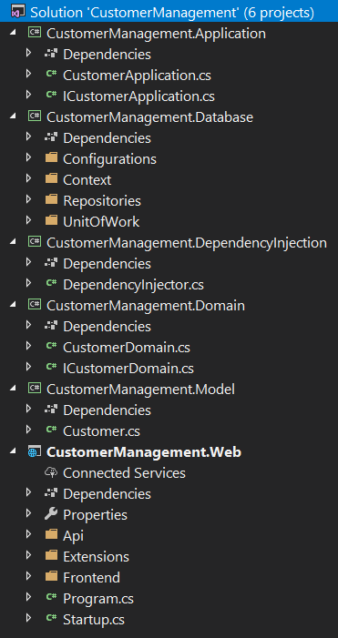
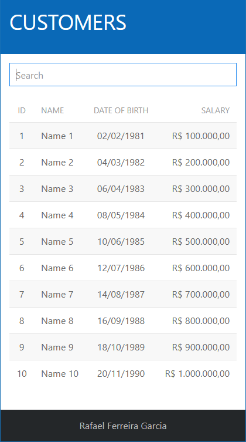

# CustomerManagement

Example to list customers.

## Tools, Practices and Technologies

* Cross-Platform (Windows, Linux, macOS)
* Visual Studio 2017
* Visual Studio Code
* .NET Core 2.1
* ASP.NET Core 2.1
* Entity Framework Core 2.1
* C# 7.3
* SPA (Single Page Application)
* Angular 7.0.2
* Typescript 3.1.6
* HTML5
* CSS3
* DDD (Domain-Driven Design)
* SOLID Principles
* Dependency Injection

## Projects

## Running

## Run Visual Studio Code

1. Install [.NET Core SDK](https://aka.ms/dotnet-download).

2. Install [C# Extension](https://marketplace.visualstudio.com/items?itemName=ms-vscode.csharp).

3. Open **source** directory.

4. Press **F5**.

## Run Command Line

1. Install [.NET Core SDK](https://aka.ms/dotnet-download).

2. Open directory **source\Web\Frontend** in command line.

3. Execute **npm run restore**.

4. Open directory **source\Web** in command line.

5. Execute **dotnet run**.

6. Open <https://localhost:8095>.
